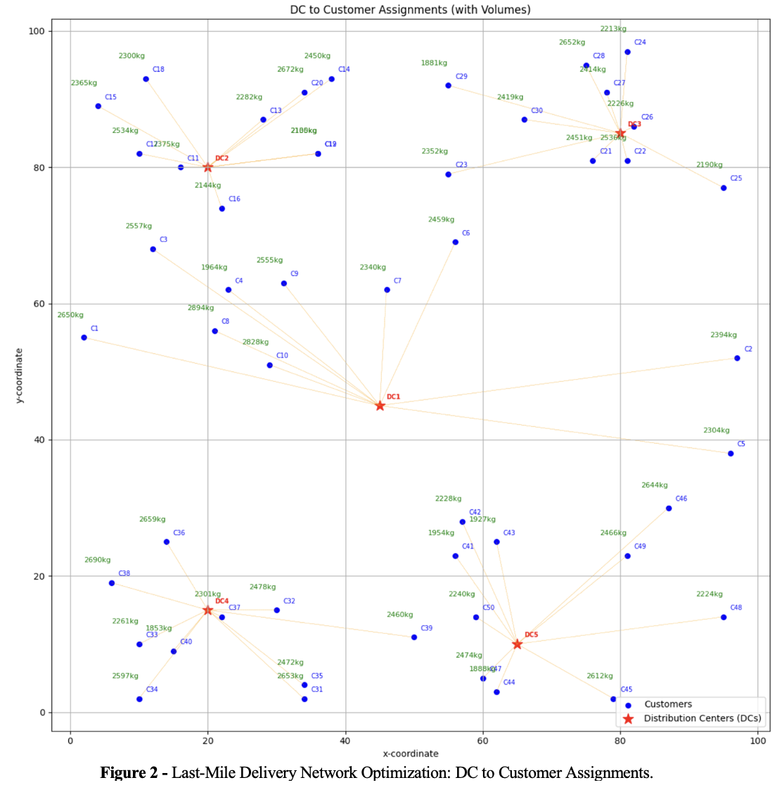

# Logistics_Analytics

## Introduction 

## Project Background and Network Description

**DeliverEase Ltd**. is an online webshop specialising in the sale and delivery of home essentials. With growing customer demand, the company aims to ensure that its distribution network can meet shipping capacity requirements while reducing operational costs.
The current network includes:

**2 suppliers (S1, S2)**

**3 warehouses (W1–W3)**

**5 distribution centres (DC1–DC5)**

**50 customers (C1–C50)**

  

### Distribution network 

The company currently operates with two suppliers **(S1 and S2)**, three warehouses **(W1, W2, and W3)**,
five distribution centers **(DC1 to DC5)**, and **50 customers (C1 to C50)**. As shown above, products
are first shipped from **suppliers** to **warehouses**, then from **warehouses** to **distribution centers**, and
finally from **distribution centers** to **customers**. Some transportation routes are unavailable: **S2** cannot
ship to **W1**; **W1** cannot ship to **DC4** or **DC5**; **W2** cannot ship to **DC2**; and **W3** cannot ship to **DC1** or
**DC2**.
 Each distribution center is responsible for delivering to **ten** nearby customers. An image **below**  shows
the geographical locations of all customers.

  

### Product Information
The company has selected five products **(P1 to P5)** for analysis. The full dataset is available in the
file **“data.xlsx”**. Product weights can be found on the **“Product weights”** sheet.

### Shipping operations
Products are transported by barge from **suppliers** to **warehouses**, and then by train from **warehouses** to
**distribution centres**. Each transportation link has a limited **capacity**. To use a link, the company must
first pay a **fixed cost** upfront to reserve its capacity. Only after this reservation can products be shipped
along that link. The **“Shipping information”** sheet in the dataset provides details on the **capacity of
each link**, as well as the associated **fixed** and **variable costs**. Variable costs are charged **per kilogram** of
product, regardless of the product type. The total weight shipped on any link must not exceed its
capacity. Note that the shipping capacity and variable costs are based on **product weight**, rather than
the number of units of product.

### Last mile delivery

Last-mile delivery covers shipments from **distribution centre**s to **customers**. The company uses its own
**vehicle fleet** and estimates transport costs based on the **distance** between each distribution centre and
**customer location**. The sheet **“Last-mile-cost per product per kg”** provides unit costs (in euros per kg
per kilometre), which vary by product type. 
Note that the distribution costs are based on product
weight , rather than the number of units of product. Coordinates for all distribution centres and
customers are listed in **“Last mile coordinates”**, and distances were calculated using the Euclidean
formula (assumed in kilometre). Customer
demands for each product type are provided in the sheet **“Demands per product type”**, representing the
number of product units ordered by **each customer**. 

## Task Overview

The project involved formulating a mathematical optimisation model to **minimise total distribution costs** for DeliverEase Ltd.’s supply chain, incorporating route availability, capacity limits, flow balance, and demand satisfaction. The model, implemented in Python using **PuLP**, was solved to identify the **optimal shipment plan** and **report total costs** and **shipment weights** for each **link** between suppliers, warehouses, and distribution centres. Network flow **visualisations** were created to illustrate shipment magnitudes, and **two data-driven managerial recommendations** were developed to enhance cost efficiency and resilience to demand uncertainty. Finally, several **limitations** and **recommendations** were considered to ensure the accuracy of the model.l

## Mathematical Programming Formulation

  

  

  

  

## Supply Chain Optimization: A PuLP Implementation for Cost Minimization

The optimization model for **DeliverEase Ltd.** resulted in a total logistics cost of **€824,980.94**, ensuring all customer demands were met while respecting **route restrictions** and **transportation capacities**. The optimized network flow, illustrated in **Figure 1**, shows how products flow efficiently from **suppliers** to **warehouses** and then to **distribution centres**. Specifically, supplier S1 ships 23,357 kg to W1, 60,000 kg to W2, and 9,424 kg to W3, while supplier S2 supplies 10,936 kg to W2 and 15,000 kg to W3. From the warehouses, W1 ships 23,357 kg to DC2; W2 distributes 24,945 kg to DC1, 23,334 kg to DC3, and 22,657 kg to DC5; and W3 ships 24,424 kg to DC4. 

  

These link-specific flows reflect the model's **cost-effective** allocation strategy, minimizing transport expenses while adhering to the company's operational constraints.

## Network Flow Visualization: Mapping Optimal Supply Chain Pathways

**Figure 2** illustrates the **optimized last-mile delivery network**, showing Customers **(blue dots)** and their assigned Distribution Centres **(red stars)**. Orange lines represent **DC-to-customer** delivery assignments. Each customer location is labelled with a **green text** indicating the total volume of goods (kg) they receive, effectively showcasing DC service areas and demand variations. The **total volume** for each customer is calculated step-by-step by multiplying the number of units of each product type by its corresponding weight and then summing these values for all products assigned to that customer.

  

**Figure 3** illustrates the optimized product flow across a **multi-tiered supply chain**. It visually maps geographical locations of Suppliers **(orange triangles)**, Warehouses **(green stars)**, and Distribution Centres **(red stars)**. Connections denote pathways:** orange lines** for supplier-to-warehouse shipments, and **green lines** for warehouse-to-DC movements. Each line is clearly labelled with the exact product volume **(kg)**, providing a comprehensive view of the logistical plan.

  

## Strategic Supply Chain Recommendations

### Recommendation (1): Strategic Network Optimization with Route Expansion

Our primary recommendation involves the strategic opening of previously unused transportation routes: (W1,DC4), (W2,DC2), (W3,DC2), (W1,DC5), and (W3,DC1).
The specific data regarding the fixed costs, variable costs, and capacity for these newly considered routes were unavailable. To ensure the accuracy of our model, we estimated these by calculating the average variable cost of existing outbound routes from Warehouses W1, W2, and W3 to various Distribution Centres (as detailed in Table 2). 

  

Recognizing that the prior unavailability of these links might stem from higher associated costs, we conservatively increased this calculated average variable cost by €2. This increment, representing approximately half of the average variable cost, is intended to account for factors such as longer distances or other increased operational expenses for these newly opened routes.

  

A key outcome of the optimization is the strategic integration of the W2-DC2 route into the operational network, which was previously unavailable. Complementing this, a notable change in traffic involves Warehouse W1: while the Initial Model directed goods from W1 to DC2, the Adjusted Model now reroutes W1's traffic to DC3 as shown in Figure 4.

By implementing these adjustments, the total transportation cost decreased from €824,980.94 to €802,060.27, representing a saving of approximately €22,920.67. This demonstrates that the proposed changes lead to a more efficient and cost-effective distribution strategy. 

  

The pie chart effectively illustrates that the Route Expansion Model accounts for a smaller proportion (49%) of the combined costs compared to the Initial Model (51%). This directly demonstrates the successful cost reduction and improved efficiency achieved through the model adjustments.

### Recommendation (2): Strategic Relocation Proposal – Northeast Site (33×60)

In large-scale distribution networks, even modest changes in facility location can yield substantial efficiency gains. This section explores a targeted relocation of Distribution Centre 1 (DC1) from its existing coordinates at (45, 45) to a proposed site at (33, 60). The motivation for this adjustment stems from spatial inefficiencies observed in last-mile delivery to nearby customers, particularly those in the C1–C10 group.

  

Figure 6 presents a visual comparison of customer locations relative to both the existing and proposed DC sites. Customers are color-coded to indicate which of the two DCs they are closer to, making it clear that the proposed site better aligns with the majority of nearby demand points. 

  

According to Table 4, 8 out of the 10 customers in this cluster would be geographically closer to the proposed DC, some by a substantial margin such as Customer C9, whose distance drops from 22.8 to just 3.61 units.

  

Operational implications of this shift are further highlighted in Figure 7, which compares total network costs under the current and proposed configurations. The optimized solution with the new DC location results in a reduced total cost of €811,587.08, compared to €824,980.94 in the initial setup. This cost improvement of over €13,000 validates the effectiveness of the relocation strategy.

## Limitations 

## Conclusion 

## How to Use

1. **Install dependencies**: pandas, matplotlib, numpy.
2. **Load datasets**: use pd.read_csv() and adjust the file path/directory as needed.

## Author  
Created by **Arsen Pankiv**  
- [LinkedIn](https://www.linkedin.com/in/arsen-pankiv-6082b4349/)  
- [GitHub](https://github.com/Arsen-Pankiv)

 