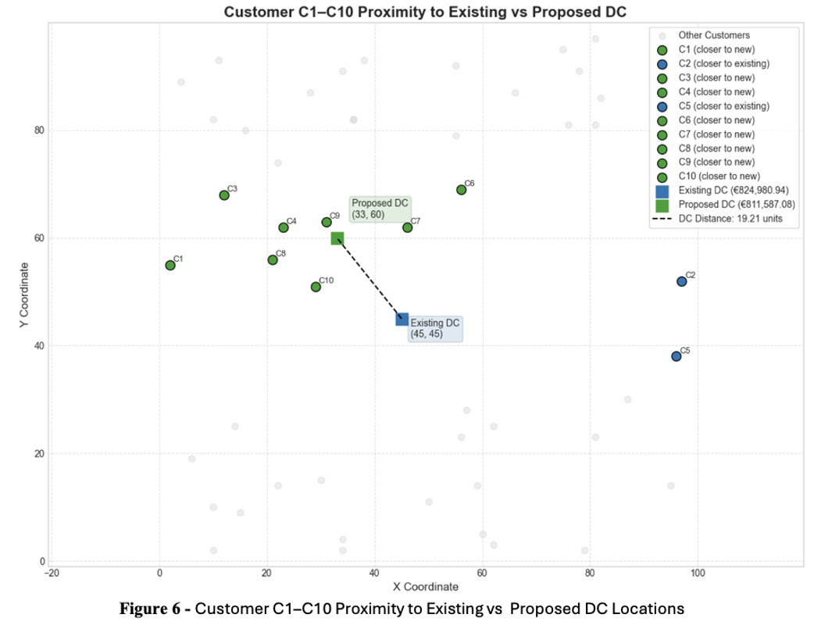

# Mathematical Optimisation of a Multi-Tier Supply Chain Network

## Introduction 

**Efficient logistics** and **supply chain management** are critical for companies aiming to balance growing customer demand with cost control. This project focuses on **DeliverEase Ltd**., an online **retailer** of home essentials, and its **multi-tier distribution network**. Using the dataset **“date 11.35.31”**, the study develops **a mathematical optimisation model** to minimise distribution costs while respecting capacity limits, route availability, and demand requirements. The approach integrates supplier-to-warehouse shipments, warehouse-to-distribution centre flows, and last-mile deliveries, providing both **quantitative insights** and **practical recommendations** to improve cost efficiency and network resilience

## Dataset Overview

The dataset **“date 11.35.31”** contains structured information to model and analyze **DeliverEase Ltd.’s** supply chain network, covering product characteristics, transportation routes, logistics costs, and customer demand. The **“Product Weight”** sheet specifies the unit weight **(in kilograms)** of products P1–P5, which is crucial for transport cost calculations. The **“Shipping Information”** sheet details available links between suppliers, warehouses, and distribution centres, including their capacities, fixed costs, and variable costs per kilogram. The **“Last Mile Coordinates”** sheet provides the **geographic positions** of distribution centres **(DC1–DC5)** and customers **(C1–C8)**, enabling the calculation of distance-based delivery costs. Complementing this, the **“Last Mile Cost per Product per KG”** sheet specifies product-dependent delivery costs per kilogram per kilometre. Finally, the **“Demands per Product Type”** sheet records **customer-level demand** for each product, serving as the basis for supply allocation and optimisation. Collectively, these datasets provide a robust foundation for supply chain modelling, transportation planning, and cost-minimisation analysis.

## Methodology 

The project leverages **Python** and **linear programming** to optimize the supply chain network. Data on shipping routes, product demand, and last-mile coordinates were processed using **pandas** and **numpy**, while costs and capacities were defined for each route. **Euclidean distances** between distribution centers and customers were calculated to estimate last-mile delivery costs. The optimization model, implemented with **PuLP**, minimizes total shipping costs by determining optimal shipment quantities along each route, while ensuring customer demand is met and route capacities are not exceeded.

## Project Background and Network Description

**DeliverEase Ltd**. is an online webshop specialising in the sale and delivery of home essentials. With growing customer demand, the company aims to ensure that its distribution network can meet shipping capacity requirements while reducing operational costs.
The current network includes:

**2 suppliers (S1, S2)**

**3 warehouses (W1–W3)**

**5 distribution centres (DC1–DC5)**

**50 customers (C1–C50)**

  

### Distribution network 

The company currently operates with two suppliers **(S1 and S2)**, three warehouses **(W1, W2, and W3)**,
five distribution centers **(DC1 to DC5)**, and **50 customers (C1 to C50)**. As shown above, products
are first shipped from **suppliers** to **warehouses**, then from **warehouses** to **distribution centers**, and
finally from **distribution centers** to **customers**. Some transportation routes are unavailable: **S2** cannot
ship to **W1**; **W1** cannot ship to **DC4** or **DC5**; **W2** cannot ship to **DC2**; and **W3** cannot ship to **DC1** or
**DC2**.
 Each distribution center is responsible for delivering to **ten** nearby customers. An image **below**  shows
the geographical locations of all customers.

  

### Product Information
The company has selected five products **(P1 to P5)** for analysis. The full dataset is available in the
file **“data.xlsx”**. Product weights can be found on the **“Product weights”** sheet.

### Shipping operations
Products are transported by barge from **suppliers** to **warehouses**, and then by train from **warehouses** to
**distribution centres**. Each transportation link has a limited **capacity**. To use a link, the company must
first pay a **fixed cost** upfront to reserve its capacity. Only after this reservation can products be shipped
along that link. The **“Shipping information”** sheet in the dataset provides details on the **capacity of
each link**, as well as the associated **fixed** and **variable costs**. Variable costs are charged **per kilogram** of
product, regardless of the product type. The total weight shipped on any link must not exceed its
capacity. Note that the shipping capacity and variable costs are based on **product weight**, rather than
the number of units of product.

### Last mile delivery

Last-mile delivery covers shipments from **distribution centre**s to **customers**. The company uses its own
**vehicle fleet** and estimates transport costs based on the **distance** between each distribution centre and
**customer location**. The sheet **“Last-mile-cost per product per kg”** provides unit costs (in euros per kg
per kilometre), which vary by product type. 
Note that the distribution costs are based on product
weight , rather than the number of units of product. Coordinates for all distribution centres and
customers are listed in **“Last mile coordinates”**, and distances were calculated using the Euclidean
formula (assumed in kilometre). Customer
demands for each product type are provided in the sheet **“Demands per product type”**, representing the
number of product units ordered by **each customer**. 

## Task Overview

The project involved formulating a mathematical optimisation model to **minimise total distribution costs** for DeliverEase Ltd.’s supply chain, incorporating route availability, capacity limits, flow balance, and demand satisfaction. The model, implemented in Python using **PuLP**, was solved to identify the **optimal shipment plan** and **report total costs** and **shipment weights** for each **link** between suppliers, warehouses, and distribution centres. Network flow **visualisations** were created to illustrate shipment magnitudes, and **two data-driven managerial recommendations** were developed to enhance cost efficiency and resilience to demand uncertainty. Finally, several **limitations** and **recommendations** were considered to ensure the accuracy of the model.l

## Mathematical Programming Formulation

### Sets

- `S`: Set of suppliers  
- `W`: Set of warehouses  
- `D`: Set of distribution centres  
- `C`: Set of customers  
- `P`: Set of products  

### Parameters

- `cap_sw` : Capacity from supplier `s` to warehouse `w` (kg)  
- `cap_wd` : Capacity from warehouse `w` to distribution centre `d` (kg)  
- `fixed_sw` : Fixed cost for using `s → w` link  
- `fixed_wd` : Fixed cost for using `w → d` link  
- `var_sw` : Variable cost per kg for `s → w` link  
- `var_wd` : Variable cost per kg for `w → d` link  
- `weight_p` : Weight of one unit of product `p` (kg/unit)  
- `dist_dc` : Euclidean distance from distribution centre `d` to customer `c`  
- `lastmilecost_p` : Cost per kg per km for product `p`  
- `demand_cp` : Demand (in units) of product `p` by customer `c`  

---

### Decision Variables

- $x_{swp} \ge 0$: Units of product $p$ transported from supplier $s$ to warehouse $w$  
- $x_{wdp} \ge 0$: Units of product $p$ transported from warehouse $w$ to distribution centre $d$  
- $x_{dcp} \ge 0$: Units of product $p$ delivered from distribution centre $d$ to customer $c$  
- $y_{sw} \in \{0,1\}$: 1 if link from $s$ to $w$ is used  
- $y_{wd} \in \{0,1\}$: 1 if link from $w$ to $d$ is used  

### Objective Function

Minimise total cost:

$$
Z_1 = \sum_{s \in S}\sum_{w \in W} \Big( fixed_{sw} \, y_{sw} + \sum_{p \in P} var_{sw} \, x_{swp} \, weight_p \Big)
$$

$$
Z_2 = \sum_{w \in W}\sum_{d \in D} \Big( fixed_{wd} \, y_{wd} + \sum_{p \in P} var_{wd} \, x_{wdp} \, weight_p \Big)
$$

$$
Z_3 = \sum_{d \in D}\sum_{c \in C}\sum_{p \in P} x_{dcp} \, weight_p \, dist_{dc} \, lastmilecost_p
$$

$$
Z = Z_1 + Z_2 + Z_3
$$

### Constraints

**Demand satisfaction**  

$$
\sum_{d \in D} x_{dcp} = demand_{cp}, \quad \forall c \in C, \forall p \in P
$$

**Distribution centre flow balance**  

$$
\sum_{w \in W} x_{wdp} = \sum_{c \in C} x_{dcp}, \quad \forall d \in D, \forall p \in P
$$

**Warehouse flow balance**  

$$
\sum_{s \in S} x_{swp} = \sum_{d \in D} x_{wdp}, \quad \forall w \in W, \forall p \in P
$$

**Link capacity (Suppliers → Warehouses)**  

$$
\sum_{p \in P} x_{swp} \, weight_p \le cap_{sw} \, y_{sw}, \quad \forall s \in S, \forall w \in W
$$

**Link capacity (Warehouses → DCs)**  

$$
\sum_{p \in P} x_{wdp} \, weight_p \le cap_{wd} \, y_{wd}, \quad \forall w \in W, \forall d \in D
$$

**Route availability (disable infeasible links)**  

$$
y_{s2,w1} = 0, \quad y_{w1,d4} = 0, \quad y_{w1,d5} = 0, \quad y_{w2,d2} = 0, \quad y_{w3,d1} = 0, \quad y_{w3,d2} = 0
$$

**Customer-to-DC allocation (fixed service areas)**  

$$
x_{dcp} = 0 \quad \text{if } c \notin CustomerGroup_d, \quad \forall d \in D, \forall c \in C, \forall p \in P
$$

**Where CustomerGroup sets**

$$
CustomerGroup_{D1} = \{ C1, C2, \dots, C10 \}
$$

$$
CustomerGroup_{D2} = \{ C11, C12, \dots, C20 \}
$$

$$
CustomerGroup_{D3} = \{ C21, C22, \dots, C30 \}
$$

$$
CustomerGroup_{D4} = \{ C31, C32, \dots, C40 \}
$$

$$
CustomerGroup_{D5} = \{ C41, C42, \dots, C50 \}
$$

---

### Variable types

$$
x_{swp}, x_{wdp}, x_{dcp} \in \mathbb{Z}_{\ge 0}
$$

$$
y_{sw}, y_{wd} \in \{0,1\}
$$

## Supply Chain Optimization: A PuLP Implementation for Cost Minimization

The optimization model for **DeliverEase Ltd.** resulted in a total logistics cost of **€824,980.94**, ensuring all customer demands were met while respecting **route restrictions** and **transportation capacities**. The optimized network flow, illustrated in **Figure 1**, shows how products flow efficiently from **suppliers** to **warehouses** and then to **distribution centres**. Specifically, supplier S1 ships 23,357 kg to W1, 60,000 kg to W2, and 9,424 kg to W3, while supplier S2 supplies 10,936 kg to W2 and 15,000 kg to W3. From the warehouses, W1 ships 23,357 kg to DC2; W2 distributes 24,945 kg to DC1, 23,334 kg to DC3, and 22,657 kg to DC5; and W3 ships 24,424 kg to DC4. 

  

These link-specific flows reflect the model's **cost-effective** allocation strategy, minimizing transport expenses while adhering to the company's operational constraints.

## Network Flow Visualization: Mapping Optimal Supply Chain Pathways

**Figure 2** illustrates the **optimized last-mile delivery network**, showing Customers **(blue dots)** and their assigned Distribution Centres **(red stars)**. Orange lines represent **DC-to-customer** delivery assignments. Each customer location is labelled with a **green text** indicating the total volume of goods (kg) they receive, effectively showcasing DC service areas and demand variations. The **total volume** for each customer is calculated step-by-step by multiplying the number of units of each product type by its corresponding weight and then summing these values for all products assigned to that customer.

  

**Figure 3** illustrates the optimized product flow across a **multi-tiered supply chain**. It visually maps geographical locations of Suppliers **(orange triangles)**, Warehouses **(green stars)**, and Distribution Centres **(red stars)**. Connections denote pathways:** orange lines** for supplier-to-warehouse shipments, and **green lines** for warehouse-to-DC movements. Each line is clearly labelled with the exact product volume **(kg)**, providing a comprehensive view of the logistical plan.

  

## Strategic Supply Chain Recommendations

### Recommendation (1): Strategic Network Optimization with Route Expansion

Our **primary recommendation** involves the **strategic opening** of previously unused transportation routes: (W1,DC4), (W2,DC2), (W3,DC2), (W1,DC5), and (W3,DC1).
The specific **data** regarding the fixed costs, variable costs, and capacity for these newly considered routes were **unavailable**. To ensure the accuracy of our model, we estimated these by calculating the average variable cost of existing outbound routes from Warehouses W1, W2, and W3 to various Distribution Centres (as detailed in **Table 2**). 

  

Recognizing that the prior unavailability of these links might stem from **higher associated costs**, we conservatively increased this calculated average variable cost by **€2**. This increment, representing approximately half of the average variable cost, is intended to account for factors such as **longer distances** or other increased operational expenses for these newly opened routes.

  

A key **outcome** of the optimization is the strategic integration of the **W2-DC2 route** into the operational network, which was previously unavailable. Complementing this, a notable change in traffic involves Warehouse W1: while the Initial Model directed goods from W1 to DC2, the Adjusted Model now reroutes W1's traffic to DC3 as shown in **Figure 4**.

By implementing these **adjustments**, the **total transportation** cost decreased from **€824,980.94** to **€802,060.27**, representing a saving of approximately **€22,920.6**. This demonstrates that the proposed changes lead to a more efficient and cost-effective distribution strategy. 

  

The **pie chart** effectively illustrates that the **Route Expansion Model** accounts for a smaller proportion (**49%)** of the combined costs compared to the Initial Model **(51%)**. This directly demonstrates the successful cost reduction and improved efficiency achieved through the model adjustments.

### Recommendation (2): Strategic Relocation Proposal – Northeast Site (33×60)

In large-scale distribution networks, even modest changes in facility location can yield substantial efficiency gains. This section explores a targeted **relocation of Distribution Centre 1 (DC1)** from its existing coordinates at **(45, 45)** to a proposed site at **(33, 60)**. The motivation for this adjustment stems from spatial **inefficiencies** observed in l**ast-mile delivery** to nearby **customers**, particularly those in the **C1–C10** group.

  

**Figure 6** presents a visual comparison of customer locations relative to both the **existing** and **proposed** DC sites. Customers are color-coded to indicate which of the two DCs they are closer to, making it clear that the proposed site better aligns with the majority of nearby demand points. 

  

According to **Table 4**, **8** out of the **10** customers in this cluster would be geographically closer to the proposed DC, some by a substantial margin such as Customer **C9**, whose distance drops from **22.8** to just **3.61** units.

  

Operational **implications** of this shift are further highlighted in **Figure 7**, which compares total network costs under the **current** and **proposed** configurations. The optimized solution with the new DC location results in a reduced total cost of **€811,587.08**, compared to **€824,980.94** in the initial setup. This cost improvement of over **€13,000** validates the effectiveness of the relocation strategy.

## Limitations and Possible Improvements of Initial Model and Strategic Recommendations 

### Model-Specific Limitations

**Estimated Cost Parameters:** New route costs and capacities were approximated using averages, which may reduce accuracy.
**Improvement**: Replace with real transport data once available.

**Unverified Route Feasibility:** Regulatory, geographic, or infrastructure constraints were not validated.
**Improvement:** Assess operational feasibility of proposed links.

**Simplified Cost Assumptions:** Uniform uplifts (e.g., €2/kg) oversimplify real variability.
**Improvement:** Use differentiated cost data for new routes.

### Relocation Proposal Limitations

**Excludes Transition Costs:** One-time relocation and capital expenses were not considered.
**Improvement:** Incorporate relocation and investment costs.

**Simplified Last-Mile Delivery:** Model omits traffic and routing complexity.
**Improvement:** Extend last-mile modelling with realistic urban delivery factors.

**Static Customer Assignment:** Customers remain fixed to DCs post-relocation.
**Improvement:** Allow dynamic assignment to optimise costs.

### General Limitations

**Deterministic Demand:** Customer demand is assumed fixed.
Improvement: Introduce stochastic demand scenarios.

**No Inventory Modelling:** Warehouses are treated as pure transshipment nodes.
**Improvement:** Add inventory levels and holding costs to capture bottlenecks.

## Conclusion 

The optimisation of **DeliverEase Ltd.’s supply chain** demonstrates how data-driven modelling can significantly reduce **logistics costs** and improve network **efficiency**. By incorporating real-world **constraints** such as capacities, fixed and variable costs, and demand satisfaction, the model identified o**ptimal shipment flows** and highlighted opportunities for further savings through **route expansion** and **strategic relocation of facilities**. These results confirm the value of **mathematical optimisation** as a decision-support tool for supply chain management, while also pointing to areas for future enhancement, including demand uncertainty, inventory considerations, and more realistic last-mile delivery modelling.

## How to Use

1. **Install dependencies**: Pulp, pandas, numpy, matplotlib.
2. **Load datasets**: use pd.read_excel() and adjust the file path/directory as needed.

## Author  
Created by **Arsen Pankiv**  
- [LinkedIn](https://www.linkedin.com/in/arsen-pankiv-6082b4349/)  
- [GitHub](https://github.com/Arsen-Pankiv)

 
